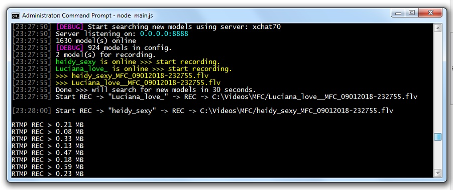

mfc-node-recorder
=================
Note: mfc-node lets you follow and record your favorite models shows on myfreecams.com

What's new?
==========
In v.1.0.8 So far, the most common error was that the DL programs were not in the windows path, so I decided to end. In the future it will be necessary to edit all paths for all DL programs in `config.yml`. This change will allow to choose which version of a program you want use with MFC Recorder, if you have multiple versions of the same program installed.
Now there is also the option of selecting 4 combinations of subdirectory names as previously existed in the basic version of the MFC Recorder. More is explained in the `config.yml` file.
Also is added possibility to see the size of the recorded files in the MB every three minutes.
Now it is possible by simply editing the `config.yml` and `index.html` file to select the program we want to use to record your favorite models show's on myfreecams.com.

mfc-node
==========
This is an attempt to create a script similar to [capturbate-node](https://github.com/SN4T14/capturebate-node) based on different pieces of code found on the Internet.

Credits:
* [capturbate-node](https://github.com/SN4T14/capturebate-node)
* [Sembiance/get_mfc_video_url.js](https://gist.github.com/Sembiance/df151de0006a0bf8ae54)
* [mfc-node](https://github.com/sstativa/mfc-node)
* [MFCD.exe](https://github.com/ruzzy/)

Requirements
============
1. [Node.js](https://nodejs.org/download/release/) used to run mfc-node, hence the name. (tested with node v.11.9.0)
2. [Livestreamer](https://github.com/chrippa/livestreamer/releases) last version 1.12.2. It's best to install it individually in 'C:/Livestreamer'
3. [Streamlink](https://github.com/streamlink/streamlink/releases) (tested with the last version 1.0.0) - better to install it independently in in 'C:/Streamlink'
4. [ffmpeg](https://ffmpeg.zeranoe.com/builds/) It is recommended to install the latest version.
5. [MFCD.exe](http://www.mediafire.com/file/aim84bicrsbbvci/MFCD.rar) MFC Dump by @RuzzyRullez (little modified)
6. [hlsdl.exe](https://github.com/samsamsam-iptvplayer/hlsdl) or (https://www.mediafire.com/file/d9obqdq71cqeehr/hlsdl.exe/file) for windows.

Setup
=====
1. Install [Node.js](https://nodejs.org/download/release/) (v8.1.3 or higher).
2. Install [Git](https://git-scm.com/downloads).
2. Download and unpack the [code](https://codeload.github.com/horacio9a/mfc-node/zip/master), create directory 'C:/-nm-mfc' and move all files from 'rar' there.
3. Open console and go into the default directory ('C:/-nm-mfc') where are located unpacked files.
4. Install requirements by running `npm install` in the same directory as `main.js` is (Windows users have to install [Git](https://git-scm.com/download/win)).
5. Edit `config.yml` file with the all necessary data.
6. `ffmpeg.exe`, `MFCD.exe` and `hlsdl.exe` now can be anywhere but the path's must be edited in `config.yml`.

Running
=======
1. Open console and go into the directory where is 'main.js'.
2. Start program with 'node main.js'.
3. Open http://localhost:8888 in your browser.

- The online model list can be sorted by various criteria (default is 'state' because at the top are the models currently being recorded). Thumbnails of models ('menu' small preview) with camscore greater than 350 will be displayed immediately. After about 60 seconds, thumbnails of other models will be visible when the mouse cursor is hover and will be updated.
- If you want to look at some of the models, click on the model name and a 'spinner' will appear with the model image in resolution 380x285 with all available model data.
- If you want to start recording, you need to click the red button ('Japanese flag'). If you want to stop recording, you need to click the stop button (right of the red button). 
- All this can be done online and track what is happening on the console, and you can view recorded file immediately if you start some media player, for example VLC.
- When you click on a preview thumbnail the large image is obtained in the next tab of your browser.
- The MFC Recorder now captures the MFC streams with five different programs (livestreamer, streamlink, ffmpeg, hlsdl and MFCD) depending on the data in config.yml ('ls', 'sl', 'ff-ts', 'ff-flv', 'hls' and 'rtmp'). Currently it is better to use 'livestreamer', 'streamlink' and 'rtmp' because they don't have the so-called 'freeze' problem as it currently has 'ffmpeg' for some models.
- Lot of people are asking, so I added the option that every model now has its own subdirectory which can be selected in the 'config.yml'.
- By pressing 'State/Online' or by press the far right button in the spinner you can enter in the model room with your browser.
- By pressing the model 'Quality' you get a video preview of the current model in separate window of your browser. For this feature in My recommendation is to use the Chrome browser with the installed add-on [Play HLS M3u8](https://chrome.google.com/webstore/detail/play-hls-m3u8/ckblfoghkjhaclegefojbgllenffajdc/related) but if you want firefox then need to install [Native HLS Playback](https://addons.mozilla.org/en-US/firefox/addon/native_hls_playback/)
- For better view `livestreamer` recording line you can replace original file:

  `.../livestreamer_cli/utils/progress.py`  with 'progress.py' on this page.

The list of online models will be displayed with a set of allowed commands for each model:
	Include - if you want to record the model
	Exclude - if you don't want to record the model anymore
	Delete - if you are not interested in the model and wanna hide her permanently

This is not a real-time application. Whenever your 'include', 'exclude' or 'delete' the model your changes will be applied only with the next iteration of 'mainLoop' function of the script. 'mainLoop' runs every 30 seconds (default value for 'modelScanInterval').
There is no 'auto reload' feature, you have to reload the list manually with 'big red button', however, keep in mind the script updates the list internally every 30 seconds ('modelScanInterval'), therefore sometimes you'll have to wait 30 seconds to see any updates.
Be mindful when capturing many streams at once to have plenty of space on disk and the bandwidth available or you’ll end up dropping a lot of frames and the files will be useless.

For advanced users
===========
There are several special URLs that allow implementing some operations with a model even if she is offline.

__Include__
```
http://localhost:8888/models/include?nm=modelname
http://localhost:8888/models/include?uid=12345678
```
__Exclude__
```
http://localhost:8888/models/exclude?nm=modelname
http://localhost:8888/models/exclude?uid=12345678
```
__Delete__
```
http://localhost:8888/models/delete?nm=modelname
http://localhost:8888/models/delete?uid=12345678
```
Places that can be clicked


New look of 'spinner'


Look after replacement of 'progress.py'


Look after 'MFCD.exe' addition for RTMP recording


